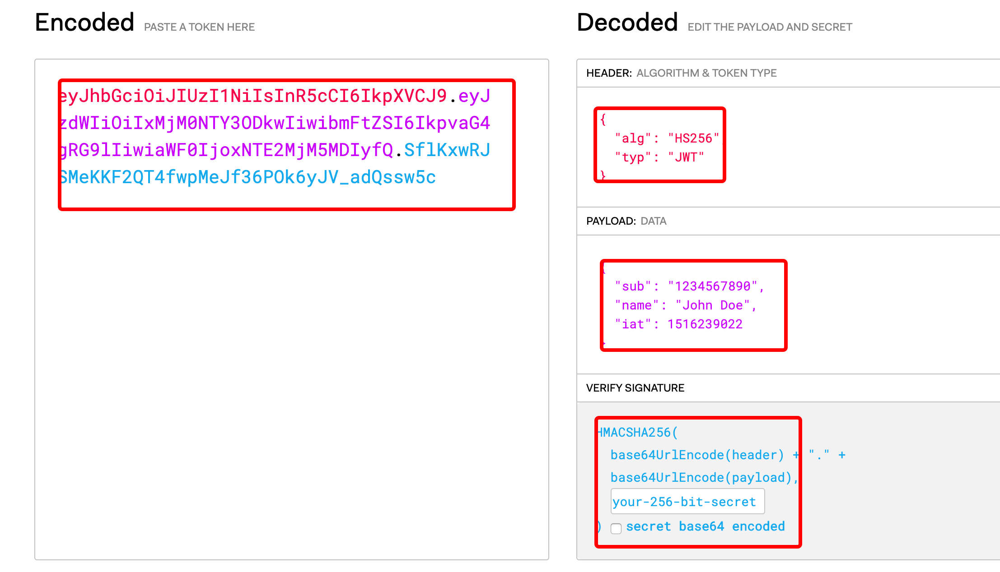

<!--
 * @Author: hucheng
 * @Date: 2019-09-07 19:47:04
 * @Description: here is des
 -->
# JWT 认证 ，Token 认证

这篇讲下 JWT 认证和基于 Token ,JWT 的全称是 `JSON Web Token`,上篇讲了，cookie，session 这种有状态的很难去适应现在互联网应用
特别是 移动应用，需要一种无状态的认证方式，JWT 就是一个很好的选择

##写在前面
1. JWT 解决的不是数据传输安全
2. JWT 解决的是服务端 cookie，session 存储，这种前后端有状态的问题
3. 常用的Token 和 JWT 认证是有一定差别的
4. JWT 和 Token 有一定的差别， JWT 适合一次性验证，比方邮件激活，Token 适合我们一般的API请求

## 常见流程
1. 用户发起请求登录，服务端验证后，通过JWT生成一个 token ,并返回个前端，
2. 前端存储起来，一般存在 sessionStorage
3. 后续 API 请求都带上这个 token，服务端通过这个 token 来验明用户身份
4. token 有一个时效性，过了时间需要重新获取，所以一般前端会在 Ajax 的请求 做个统一的 interceptors


## 组成
`Header.Payload.Signature`,看到的一般是这个样子 `adfafdsfsadf.dfdswerwe.sfsxsdf3`

- Header
```
{
  "alg": "HS256", // 标记签名的算法
  "typ": "JWT"
}
```
- Payload 

```
{
  "sub": "1234567890", //  payload 这里是存我们的方存放的用户信息
  "name": "John Doe",
  "admin": false,
  exp: number // 过期时间
  ......
}
```
- Signature 签名 
 密钥 好好保存

来个伪代码展示下

```
const signature = HMACSHA256(
  base64UrlEncode(header) + "." +
  base64UrlEncode(payload),+ "." +
  secret);
  res.send({signature: signature})

```
因为 header，payload 实际是个base64 过的，所以拿到后经过 base64 解码后是可以看到实际内容的，**所以隐私数据不要放在 payload里**，payload 存放用户的基本信心，userId，userName，mail啥的
你可以把自己生成的 signature 贴在 https://jwt.io/ 看看



看上面图,那既然可以看到实际内容，有坏人拿到了 signature 把 signature 内容改一改不就出大问题了么，比方上面的 `admin: false`,改成 true，那这不就出大事了么，所以有个 secret,服务端拿到了 signature 后 会用 secret 做个验签，就是防止内容被改变,所以 secret 要好好保存，并且要定时更换，一般 payload里会存放个 过期时间字段

## 注意点

问题来了，有人就说啊，为什么我一般在调用后端API的时候，都只有一个长长的字符串啊，没有见到这个 x.x.x 的三段式啊？

我们一般见到的Token 其实都是一段长的字符串 `45634sdfgasaxdsdfv`，没有`werwecbgsdfs.werwqecsgry.674csfbd`,为啥不用 JWT 呀，大家想想，对于 API请求 header 这个其实是多余的的，只要我的 token 能唯一标记是哪个用户就可以，也不需要 验签这个流程的，我只需要 在 Redis 存储用户 和 Token 的关系就好,所以 JWT 和 Token的 差别是，JWT不需要 在后端存储 用户 和 signature 的关系，只需要做个验签就可以

所以 JWT 适合做一次行验证，比方邮箱激活账号，Token 适合做 API 请求认证

2者的差别就是 Token 需要服务端存储 token 和用户的关系，JWT不需要，这二者对于前端开发者来说，在调用方式上没有差别
